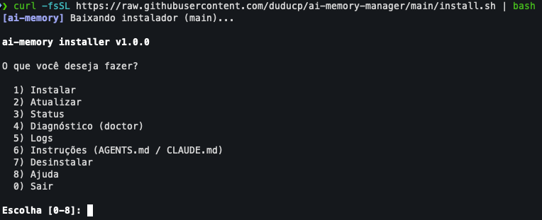

# ai-memory-manager

Instalador multi-plataforma para o [ai-memory](https://github.com/akitaonrails/ai-memory), com serviço de usuário (`launchd` no macOS, `systemd --user` no Linux), validação SHA-256, rollback automático em updates e detecção/configuração automática de agentes de IA.

O script baixa a release oficial do ai-memory, instala o binário, registra o servidor HTTP como serviço do usuário e conecta os agentes suportados (MCP + hooks) encontrados na máquina.

## O que é o ai-memory

O [ai-memory](https://github.com/akitaonrails/ai-memory) é um servidor de **memória de
longo prazo para agentes de programação com IA**. Ele resolve o problema de continuidade:
você pode parar no meio de uma tarefa no Claude Code, abrir o Codex no mesmo diretório e
continuar sem reexplicar a arquitetura, as abordagens que falharam ou as perguntas em
aberto.

- **Entre agentes:** mais de 20 harnesses (Claude Code, Codex, Cursor, Gemini CLI,
  OpenCode, Grok, Devin, Kimi, Kiro, etc.) compartilham a mesma memória.
- **Entre máquinas:** a memória vive num servidor que você mesmo roda — no laptop, num
  homelab ou na LAN.
- **Em equipe:** um servidor por time, com atribuição por pessoa e log de auditoria.
- **Memória em markdown:** a fonte da verdade é um wiki de arquivos `.md` versionado em
  git; o banco é apenas um índice derivado, reconstruível a partir dos arquivos.
- **Captura automática:** hooks de ciclo de vida registram prompts, chamadas de ferramenta
  e limites de sessão, sanitizados antes de armazenar. Funciona sem nenhuma chamada de LLM.

Na prática é um único binário que expõe um servidor HTTP/MCP (por padrão em
`127.0.0.1:49374`) e guarda tudo em um diretório de dados.

Para ver quanto conteúdo já foi acumulado: `install.sh status` mostra o tamanho em disco,
e `ai-memory status` (ou a ferramenta MCP `memory_status`) mostra contagens de páginas,
sessões e observações.

## O que este projeto faz

Este repositório é o **instalador** do ai-memory para macOS e Linux. Ele não faz parte do
projeto upstream e não reimplementa nada: baixa a release oficial e orquestra a instalação.

Em um único comando (`curl | bash`), ele:

1. Detecta o sistema operacional e a arquitetura (arm64/x86_64).
2. Baixa a release oficial do ai-memory e **valida o SHA-256** antes de instalar.
3. Instala o binário e o coloca no `PATH` (`~/.local/bin`).
4. Registra o servidor como serviço do usuário — `launchd` no macOS, `systemd --user` no
   Linux — para iniciar no login e reiniciar sozinho.
5. Detecta os agentes de IA instalados na máquina e conecta cada um via MCP e hooks,
   delegando aos comandos oficiais `install-mcp` / `install-hooks`.
6. Atualiza com **rollback automático**: se a nova versão falhar no `init`, no serviço ou
   no HTTP, a versão anterior é restaurada.

O que ele **não** faz: configurar provedores de LLM, autenticação ou deploy remoto do
servidor — para isso, veja a documentação do upstream.

## Instalação rápida (via curl)

O mesmo `install.sh` detecta o sistema operacional (macOS e Linux).

### Interativo (menu)

Sem argumentos, abre um menu para escolher o que fazer: instalar, atualizar, status,
doctor, logs, instruções, desinstalar e um submenu de serviço (start/stop/restart/reset).
Funciona em `curl | bash` porque o menu lê de `/dev/tty`:

```bash
curl -fsSL https://raw.githubusercontent.com/duducp/ai-memory-manager/main/install.sh | bash
```

Ao abrir, o menu consulta a última release do ai-memory e avisa quando há atualização
disponível (best-effort, com timeout curto; sem aviso se estiver offline).



### Instalação direta (sem menu)

Passe o comando após `-s` para pular o menu.

**macOS**

```bash
curl -fsSL https://raw.githubusercontent.com/duducp/ai-memory-manager/main/install.sh | bash -s install
```

**Linux (Ubuntu 22.04+ / Debian 12+)**

```bash
curl -fsSL https://raw.githubusercontent.com/duducp/ai-memory-manager/main/install.sh | bash -s install
```

> Sem terminal (por exemplo em CI), o script não abre o menu e mostra a ajuda.

Os demais comandos funcionam do mesmo jeito: `bash -s status`, `bash -s doctor`,
`bash -s update`, `bash -s uninstall`.

### Forma recomendada (mais segura)

Baixe, inspecione e execute:

```bash
curl -fsSL https://raw.githubusercontent.com/duducp/ai-memory-manager/main/install.sh -o install.sh
less install.sh
bash install.sh install
```

### Versão, cores e rede

Para fixar uma branch ou tag, defina `AI_MEMORY_MANAGER_REF`:

```bash
curl -fsSL https://raw.githubusercontent.com/duducp/ai-memory-manager/main/install.sh | AI_MEMORY_MANAGER_REF=v1.0.0 bash -s install
```

O menu e as mensagens usam cor apenas quando a saída é um terminal. Defina
`NO_COLOR=1` para desativar as cores.

> Em modo pipe, o `install.sh` baixa um snapshot do repositório (o `src/`) a cada
> execução, então `status`/`doctor`/`logs` também exigem rede. Em um checkout local, os
> módulos de `src/` são usados diretamente, sem download.

## Requisitos

- **macOS** (arm64 ou x86_64): `curl`, `tar`, `shasum` (ou `sha256sum`), `launchctl`, `plutil`, `python3`.
- **Linux** (Ubuntu 22.04+ / Debian 12+, com `systemd --user`): `curl`, `tar`, `sha256sum` (ou `shasum`), `systemctl`, `loginctl`, `python3`.

## Comandos

| Comando | Descrição |
| --- | --- |
| `install` | Baixa a release, instala o binário, cria o serviço do usuário e configura os agentes detectados. |
| `update` | Atualiza para a última release com validação SHA-256 e rollback automático em caso de falha. Não faz nada se já estiver na última versão (use `update --force` para reinstalar). |
| `start` | Inicia o serviço. |
| `stop` | Para o serviço. |
| `restart` | Reinicia o serviço. |
| `reset` | Apaga toda a memória (`wiki/`, `db/`, `raw/`). Pede confirmação; use `reset --yes` em modo não interativo. |
| `status` | Mostra versão, serviço, servidor, tamanho dos dados, agentes detectados e avisa se há atualização. |
| `doctor` | Diagnóstico completo da instalação, com verificações e health dos agentes. |
| `logs` | Acompanha os logs do servidor em tempo real. |
| `instructions` | Atualiza `AGENTS.md`/`CLAUDE.md` do projeto ou os arquivos globais dos agentes detectados (`--scope project\|global\|both`, Português ou English). |
| `uninstall` | Remove o ai-memory e as integrações, preservando os dados. |
| `uninstall --purge` | Remove tudo, incluindo a memória persistente. |
| `help` | Exibe a ajuda. |

### Exemplos

```bash
bash install.sh update
bash install.sh status
bash install.sh doctor
bash install.sh start
bash install.sh restart
bash install.sh reset          # pede confirmação
bash install.sh reset --yes    # sem confirmação
bash install.sh logs --error
bash install.sh logs --tail 100
bash install.sh instructions --scope project --lang pt-BR --target both
bash install.sh instructions --scope global --lang en    # arquivos globais dos agentes
bash install.sh instructions --scope both --lang pt-BR   # projeto + global
bash install.sh uninstall
```

No escopo `global`, o roteamento é gravado nos arquivos globais dos agentes
detectados (`~/.claude/CLAUDE.md`, `~/.codex/AGENTS.md`,
`~/.config/opencode/AGENTS.md`, `~/.gemini/GEMINI.md`) e as Agent Skills vão para
os roots globais. Agentes sem arquivo global documentado são apenas avisados e
ignorados. Use `--print` para pré-visualizar sem escrever.

Via curl:

```bash
curl -fsSL https://raw.githubusercontent.com/duducp/ai-memory-manager/main/install.sh | bash -s status
curl -fsSL https://raw.githubusercontent.com/duducp/ai-memory-manager/main/install.sh | bash -s update
```

## O que é instalado

| Item | macOS | Linux |
| --- | --- | --- |
| Binário / release | `~/Applications/ai-memory` | `~/.local/share/ai-memory` |
| Link no PATH | `~/.local/bin/ai-memory` | `~/.local/bin/ai-memory` |
| Dados | `~/Library/Application Support/ai-memory` | `~/.local/share/ai-memory` |
| Config | `~/Library/Application Support/ai-memory` | `~/.config/ai-memory` |
| Logs | `~/Library/Logs/ai-memory` | `~/.local/state/ai-memory` |
| Serviço | `~/Library/LaunchAgents/com.ai-memory.server.plist` | `~/.config/systemd/user/ai-memory.service` |

- **Servidor:** `http://127.0.0.1:49374`
- **MCP:** `http://127.0.0.1:49374/mcp`

No macOS o LaunchAgent usa `RunAtLoad` e `KeepAlive`. No Linux o unit `systemd --user` usa
`Restart=always` e o instalador tenta habilitar `linger` para o servidor continuar rodando
sem uma sessão aberta.

## Agentes suportados

A detecção usa primeiro o executável do agente e depois seus diretórios de configuração. A configuração real é delegada aos comandos oficiais `install-mcp` / `install-hooks` do ai-memory, respeitando o formato de cada agente.

**MCP + hooks:** Claude Code, Codex, Command Code, Devin, OpenCode, Cursor, Gemini CLI, OMP, Pi, OpenClaw, Antigravity CLI, Grok, ZCode, Kimi Code, Kiro CLI.

**Somente MCP:** Swival, Claude Desktop, Zed, VS Code Copilot, Muse Code.

**Outros:** Pool (hooks-only), Crush (managed-only).

## Segurança

- Verificação de integridade **SHA-256** obrigatória no download da release.
- Substituição de release com retenção da versão anterior até a validação.
- **Rollback automático** se o `init`, o serviço ou o servidor HTTP falharem.
- O `uninstall` é ownership-aware: não apaga arquivos de configuração de agentes cegamente.

## Estrutura do repositório

```
install.sh              # bootstrap (entry do curl)
Makefile                # lint, syntax, check
CONTRIBUTING.md         # como contribuir
menu.png                # screenshot do menu interativo
src/
  main.sh               # dispatch de comandos + fluxos install/update/uninstall
  common.sh             # logging, helpers, sha256, wait_for_server, prompt
  release.sh            # download, validação, instalação atômica, rollback
  agents.sh             # detecção e configuração de agentes
  commands.sh           # status, doctor, logs, instructions, menu
  platform/
    macos.sh            # paths, launchd, checks
    linux.sh            # paths, systemd --user, checks
```

## Desenvolvimento

```bash
make check    # shellcheck + bash -n (obrigatório antes de PR)
make lint     # só shellcheck
make syntax   # só bash -n
make help     # lista os alvos
```

Veja [`CONTRIBUTING.md`](CONTRIBUTING.md) e [`AGENTS.md`](AGENTS.md) para as
convenções e o contrato de plataforma.

## Licença

MIT — veja [LICENSE](LICENSE).
